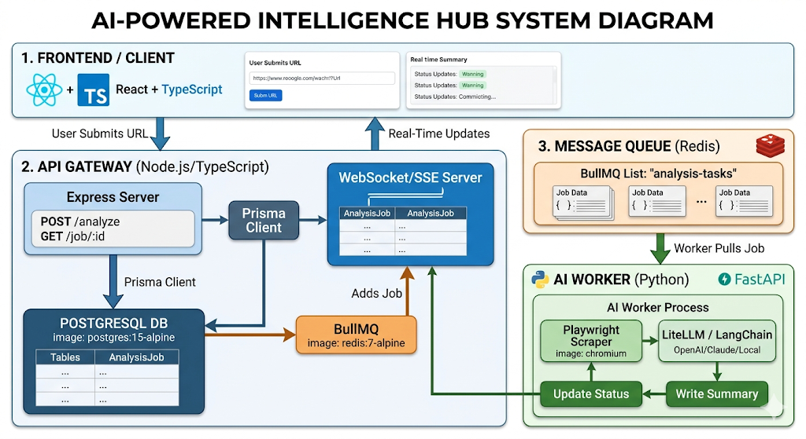

# ai-intelligence-hub
AI-Powered Content Summarizer &amp; Intelligence Hub

Current work in progress, very new. Please see the design I put together for it though. 

Project Scope (Stories)
- [x] Stand up project
- [x] Create and make sure you can run docker services on your machine locally
- [x] Use Prisma to create a database schema
- [x] Create some endpoints to post and get data
- [x] Add a simply frontend so that you can use the app
- [x] Add Redis queue in prep for a worker to pull the url for processing
- [x] Add python worker to pull messages
- [x] Implement python worker to connect to the db and save processing
- [x] Implement website scraper using Playwright engine
- [x] More specifically scrape also with Playwright MCP (scope creep)
- [x] Add a local LLM and AI powered content summarizer, using Ollama and Qwen
- [ ] Save out summaries so the UI can display some nice stuff
- [ ] Update frontend to use summaries and display something that looks like an app (no UX in mind yet)
- [ ] Switch over the LLM to using LangChain for summaries
- [ ] Add websocket and push controls so the app can get real time updates

### Design


### Running Current Backend
```
cd api
npm install
npm run dev
curl -X POST http://localhost:3000/analyze -H "Content-Type: application/json" -d '{"url": "website url"}'
```

This should spin up the endpoint and allow you to hit it from your local machine.

### Running Current Frontend
```
cd client-react
npm install
npm run dev
http://localhost:5173
```
This should allow you to navigate in your browser to the frontend.

### Docker
```
docker-compose down -v
docker-compose up -d
```

### Redis Debugging
```
docker-compose exec redis redis-cli
```

### Postgres Debugging
Connect to the DB
```
psql -U user -d intelligence_db
```

See list of tables
```
\dt
```

View table structure
```
\d "AnalysisJob"
```

See data from table
```
SELECT * FROM "AnalysisJob"
```
